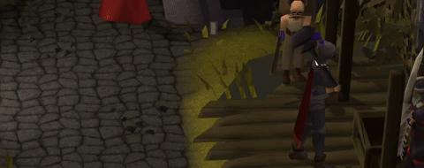

#  Bronzeman Unleashed

**Ironman without the chores.** Unlock items before you can trade them. Play solo or sync with your group.

---

## Installation

Search "Bronzeman Unleashed" in the RuneLite Plugin Hub and click Install.

---

## What is Bronzeman mode?

Can't trade items you haven't unlocked. Once unlocked, trade freely.

Skip the herb runs. Skip the resource grinding. Do the content you actually want to do.

---

## Unlock Overlay

Every unlock gets celebrated.

---

## Your Rules

Configure your own restrictions:
- Track only tradeable items
- Restrict ground item pickups
- Block GE buy offers for locked items
- Prevent trades outside your group
- Restrict POH access
- Limit PvP loot

---

## Group Play

Play with friends. Shared unlocks, live notifications, real-time sync via Firebase.

---

## Track Your Progress

Search, sort, filter. See who unlocked what and when.

---

## Getting Started

The plugin walks you through setup. For Firebase configuration, see the [setup guide](firebase-guide.md).

---

## Feedback

Found a bug? Have a suggestion? [Open an issue](https://github.com/elertan/bronzeman-unleashed/issues).

**Currently in beta.**
